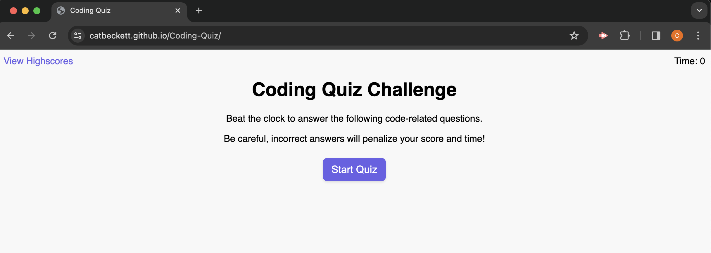
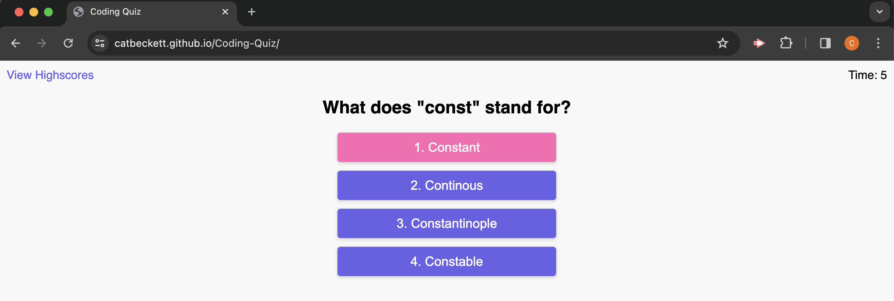
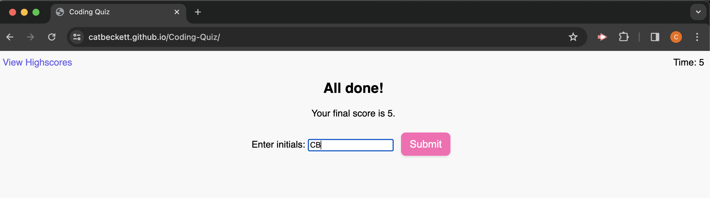
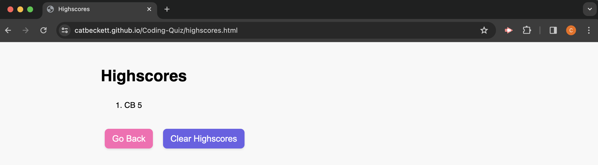

# Coding-Quiz

## Overview

The Coding-Quiz Application is a web-based quiz platform designed to test users' knowledge on various topics. It presents multiple-choice questions to users and evaluates their answers in real-time. Users can see their final score upon completion of the quiz and have the option to save their scores with their initials for future reference. This app runs in the browser, and features updated HTML and CSS powered by JavaScript code which deploys a clean, polished, and responsive user interface. Please see the deployed app here: https://catbeckett.github.io/Coding-Quiz/

## Features

- `Timer`: The application includes a countdown timer that tracks the time remaining for the quiz. The timer starts when the user begins the quiz and stops when the quiz ends or the time runs out.
- `Multiple Choice Questions`: Each question is presented with a range of multiple-choice answers. Users can select their answers by clicking on the corresponding buttons.
- `Real-time Feedback`: The application provides real-time feedback on user answers. Users receive immediate feedback indicating whether their answer was correct or incorrect.
- `Scoring`: Users earn points based on their answers. The final score is displayed at the end of the quiz.
- `Score Submission`: Users have the option to submit their scores with their initials for saving in the browser's local storage.
- `Highscores Page`: Saved scores can be viewed on the Highscores page, allowing users to track their performance over time.

## Usage

To use the Quiz Application:

1. Open the `index.html` file in a web browser.
2. Click on the "Start Quiz" button to begin the quiz.
3. Answer each question by selecting one of the multiple-choice options.
4. Receive real-time feedback on each answer.
5. Complete all questions or wait for the timer to run out.
6. Enter your initials and click "Submit" to save your score.
7. View saved scores on the Highscores page (`highscores.html`).

## Targeted Variables
Variables to store references to various HTML elements used in the application, such as buttons, screens, feedback, timer, and score lists.

## Function List
Functions to initialize the quiz, start the timer, track time remaining, display questions, check answers, show feedback, navigate to the next question, stop the countdown, and display the end screen.

## License

The Coding-Quiz app is open-source and available under the MIT License.

## Screenshot

